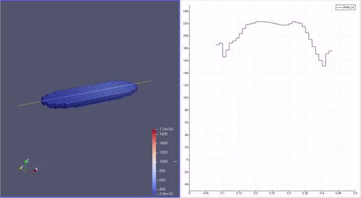

# AM simulation

This is the code base for the coupled thermal-mechanical simulation in additive manufacturing (powder bed fusion), where we solve for temperature field and J2 plasticity with FEniCSx to study the residual stress behavior of the sample. This code is being developed under [AMPL](https://www.cao.mech.northwestern.edu/) at Northwestern University. 

Below is a simple demonstration. The left one shows the temperature, while the right one shows the residual stress along the yellow line in the left figure. Note that FEniCSx do not have element activation feature, the "birth" of those elements you see is the post-processing results in ParaView. Our simulation domain is still a box-like region.

  

TODO: Solve the Navier-Stokes equation for a more accurate temperature field.